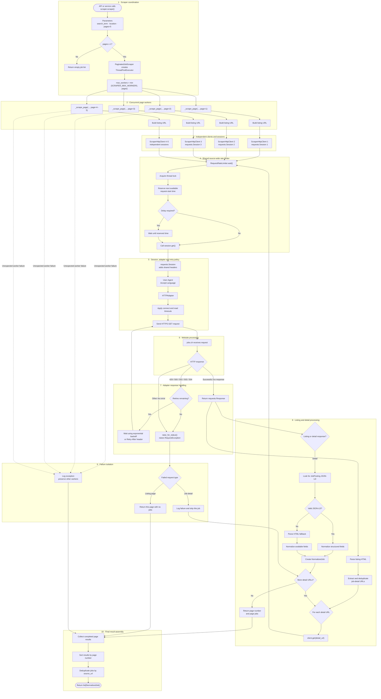

# Job Scraper Request and Response Workflow

## Component ownership

| Component | File | Responsibility |
|---|---|---|
| `BaseJobScraper` | `backend/api/scrapers/base.py` | Defines the common scraper contract |
| `PaginatedJobScraper` | `backend/api/scrapers/base.py` | Thread pool, page coordination, failure isolation, and final merging |
| `JobsChScraper` | `backend/api/scrapers/jobs_ch.py` | jobs.ch URLs, listing parsing, detail parsing, and normalization |
| `RequestRateLimiter` | `backend/api/scrapers/http.py` | Coordinates request timing across every worker |
| `ScraperHttpClient` | `backend/api/scrapers/http.py` | Applies rate limiting and performs HTTP operations |
| `requests.Session` | Created inside `ScraperHttpClient` | Maintains headers and connections for one worker |
| `HTTPAdapter` | Mounted on each session | Connection pooling and automatic retries |
| `Retry` | Installed through the adapter | Status handling, exponential backoff, and `Retry-After` support |

Each thread owns an independent HTTP session, while every thread in the scraper
shares one rate limiter. This preserves safe concurrency while enforcing a single
source-wide request rate.
