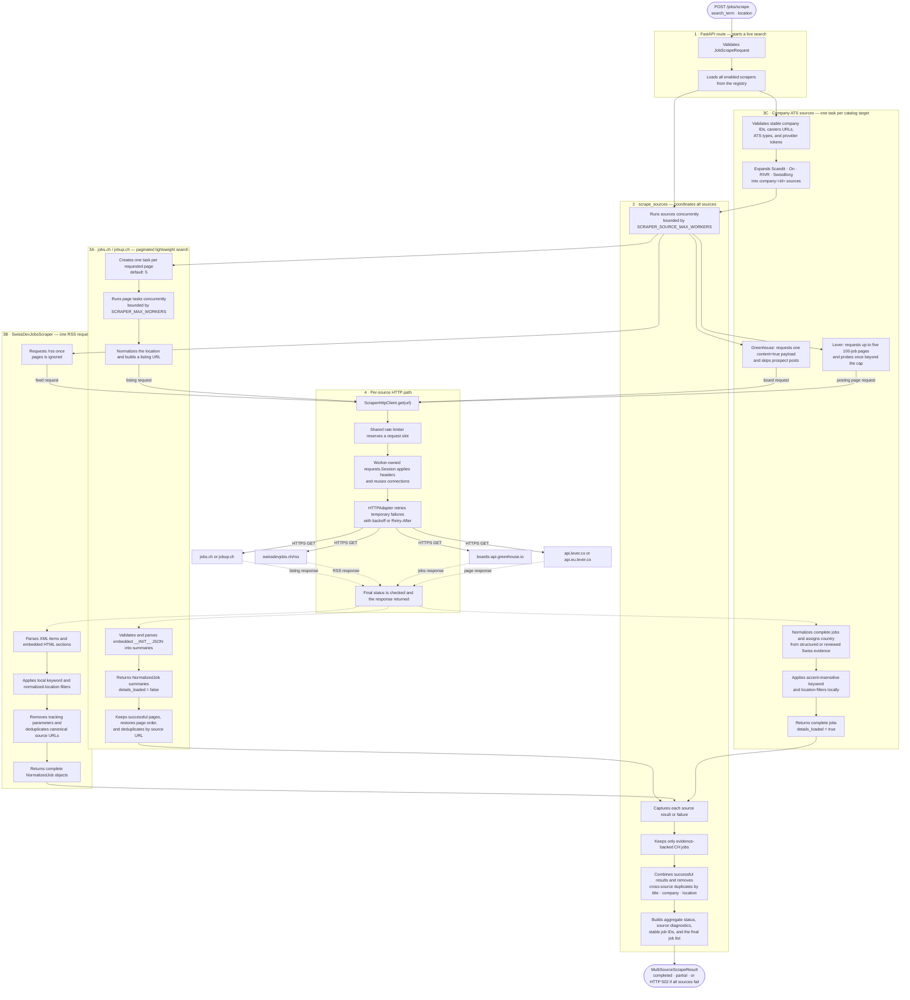

# Job Scraper Workflow

This document shows the normal path from `POST /jobs/scrape` through all job
sources and back to the frontend. The diagram emphasizes which component is
responsible for each part of the work and reflects the source-neutral lazy-detail flow.



## On-demand source detail workflow

The live search deliberately does not request every JobCloud detail page. A
detail is loaded only when the user selects an incomplete summary from a source
that implements the detail capability. RSS and ATS records already contain
their complete normalized descriptions.

```mermaid
flowchart LR
    SELECT(["User selects an incomplete result"])
    CHECK{"details_loaded?"}
    USE["Use the already complete job"]
    ROUTE["GET /jobs/details/{source_id}/{external_id}"]
    RESOLVE["Registry resolves a detail-capable scraper"]
    VALIDATE["Source validates its external ID"]
    FETCH["Fetch the detail through the same<br/>client · limiter · session · retry path"]
    JSONLD{"JobPosting JSON-LD found?"}
    STRUCTURED["Parse structured job fields"]
    FALLBACK["Parse title and description<br/>from the HTML fallback"]
    ATTRIBUTES["Normalize seniority · remote type<br/>and required languages"]
    REPLACE["Return details_loaded = true and replace<br/>the summary in frontend state and cache"]
    ACTIONS["Enable star, applied, and external Apply actions"]

    SELECT --> CHECK
    CHECK -->|"yes / RSS or ATS job"| USE
    CHECK -->|"no"| ROUTE --> RESOLVE --> VALIDATE --> FETCH --> JSONLD
    JSONLD -->|"yes"| STRUCTURED --> ATTRIBUTES
    JSONLD -->|"no"| FALLBACK --> ATTRIBUTES
    ATTRIBUTES --> REPLACE --> ACTIONS
```



## Responsibility boundaries

| Component | Responsible for | Not responsible for |
|---|---|---|
| Scraper registry | Returning fixed board sources, expanding the validated company catalog into one `company:<id>` source per target, and resolving optional detail capability | Scraping, parsing, or HTTP error translation |
| Company target catalog | Validating stable IDs, company names, careers URLs, ATS types, and Greenhouse or Lever tokens before requests begin | Discovering ATS platforms or bypassing access controls |
| `POST /jobs/scrape` route | Validating the request, loading registered scrapers, and translating total failure to HTTP 502 | Source scheduling, parsing, or persistence |
| Generic detail route | Resolving a detail-capable source, delegating one external ID, and translating validation, missing-job, and upstream errors | Source-specific URL construction or parsing |
| `scrape_sources` | Bounded source concurrency, source-failure isolation, exact-`CH` filtering, cross-source deduplication, aggregate status, and stable response IDs | Source-specific URLs, parsing, or HTTP retries |
| `BaseJobScraper` / `DetailJobScraper` | Defining the common search contract and the optional on-demand detail capability | Threads, HTTP, or source parsing |
| `PaginatedJobScraper` | Page tasks, bounded page concurrency, partial-page success, page ordering, and source-URL deduplication | Website-specific URLs or HTML/JSON parsing |
| `JobsChScraper` | Building jobs.ch listing URLs, parsing lightweight summaries, and loading one detail on demand | Cross-source coordination or interaction persistence |
| `JobupChScraper` | Supplying jobup.ch identity and paths while reusing the shared JobCloud listing/detail behavior | Cross-source coordination or a duplicate parser |
| `SwissDevJobsScraper` | Fetching and parsing RSS, local search filtering, canonical URLs, and complete RSS job normalization | Pagination or on-demand detail loading |
| `GreenhouseScraper` | Fetching one full-content public board, skipping prospect posts, deduplicating IDs, and returning complete normalized jobs | Company discovery, pagination, or on-demand detail loading |
| `LeverScraper` | Selecting the global or EU API, bounded 100-item pagination, an exact-boundary probe, repeated-page guards, list-section normalization, ID deduplication, and complete normalization | Company discovery or on-demand detail loading |
| ATS search helper | Applying case- and accent-insensitive keyword and location filters across complete company jobs | Fetching, country inference, or frontend filtering |
| Swiss territory service | Preferring structured country data and conservatively recognizing reviewed Swiss place evidence | Geocoding unknown locations or trusting a company's nationality |
| `RequestRateLimiter` | Enforcing one request-start rate across clients belonging to a cached scraper | Sending or interpreting responses |
| `ScraperHttpClient` | Applying the limiter, timeouts, retry-enabled sessions, final status checks, and cleanup | Understanding source payloads |
| `job_attribute_extraction` | Deterministically normalizing seniority, languages, and remote type | Fetching jobs or AI-based scoring |
| Frontend detail loader | Fetching any incomplete job by source and external ID, then replacing its cached summary | Knowing source-specific endpoints or scraping all details during search |
| DynamoDB interaction service | Saving only starred/applied job snapshots after explicit user actions | Persisting live-search results or scrape diagnostics |

## Important ownership rule

```text
One backend process
├── one cached JobsChScraper
│   ├── one shared jobs.ch RequestRateLimiter
│   └── concurrent page workers
│       ├── worker 1 → HTTP client 1 → Session 1 → HTTPAdapter
│       ├── worker 2 → HTTP client 2 → Session 2 → HTTPAdapter
│       └── worker N → HTTP client N → Session N → HTTPAdapter
├── one cached JobupChScraper
│   ├── one shared jobup.ch RequestRateLimiter
│   └── concurrent page workers with independent HTTP sessions
├── one cached SwissDevJobsScraper
│   ├── one shared SwissDevJobs RequestRateLimiter
│   └── one request → HTTP client → Session → HTTPAdapter
├── one cached company scraper per catalog target
│   ├── Greenhouse target → one full-content API request
│   ├── Lever target → bounded 100-job API pages
│   └── one target-owned RequestRateLimiter and HTTP client
└── scrape_sources
    └── bounded source workers run all scraper instances concurrently
```

Sessions are independent because each belongs to one worker/client context. A
limiter is shared within each cached scraper so concurrent requests to that
source obey one combined rate. The source executor and jobs.ch page executor
have separate bounds.

## Normal workflow in plain language

1. FastAPI validates `JobScrapeRequest`. The registry supplies the cached
   jobs.ch, jobup.ch, and SwissDevJobs adapters, validates the company catalog,
   and adds one cached `company:<id>` scraper for Scandit, On, RIVR, and
   SwissBorg before passing the full source list to `scrape_sources()`.
2. The source executor starts all scrapers concurrently, up to
   `SCRAPER_SOURCE_MAX_WORKERS`.
3. `JobsChScraper` creates five page tasks by default. Each worker normalizes
   the requested location, fetches one listing, and validates its embedded
   `__INIT__` structure before creating lightweight summaries without opening
   detail pages. A valid empty results list succeeds; a missing or malformed
   payload raises `ScrapeError`.
4. The jobs.ch coordinator preserves successful pages even if another page
   fails. It raises `ScrapeError` only when every requested page fails, then
   restores page order and removes duplicate source URLs.
5. `JobupChScraper` follows the same paginated and lazy-detail flow with
   jobup.ch-specific listing and detail paths. `SwissDevJobsScraper` fetches its
   RSS feed once, parses XML and embedded HTML, applies the search and location
   filters locally, removes tracking parameters, and returns complete jobs.
6. Each Greenhouse company source requests one public full-content board,
   excludes prospect posts, and deduplicates job IDs. Each Lever company source
   selects the global or EU API and reads bounded 100-item pages, failing on a
   repeated page or confirmed page-limit exhaustion. It folds every labelled
   list section into the normalized description, so provider-specific headings
   remain searchable. Both adapters apply the term and location locally without
   accent sensitivity and return `details_loaded=true` jobs. Their raw payloads
   keep only the parser and target ID without duplicating normalized content.
7. Every request passes through its scraper's shared rate limiter and a
   worker-owned retry-enabled session with configured connect/read timeouts.
8. `scrape_sources()` records each board or company source as completed or
   failed without letting one source failure stop the others.
9. The three Swiss boards assign `CH` from trusted source scope. Global ATS jobs
   use structured country data first and otherwise require reviewed Swiss
   country, canton, or employment-centre evidence. Orchestration removes every
   foreign or unclassified result.
10. Jobs from successful sources are conservatively deduplicated using normalized
   title, company, and location. The aggregate count describes this final list;
   per-source counts remain the raw diagnostic counts.
11. The API returns `completed` when all sources succeed, `partial` when at least
   one succeeds, and HTTP 502 with a failed result only when all sources fail.
12. Selecting an incomplete JobCloud summary triggers the generic detail
    endpoint. JSON-LD is preferred, HTML is the fallback, normalized attributes
    are extracted, and the frontend replaces the summary with the complete job.
    Complete RSS and ATS jobs skip this request.
13. Live-search results are not written to DynamoDB. Only explicit star/applied
    interactions save a complete job snapshot; recent search results are cached
    in browser `localStorage`.
