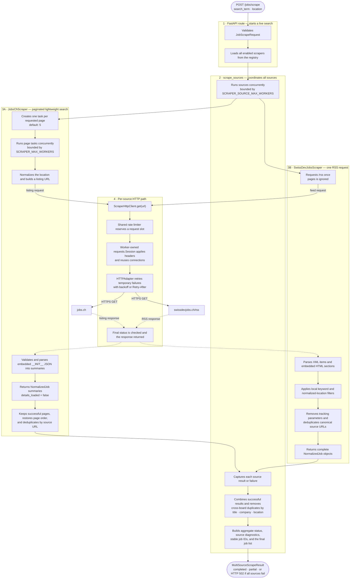

# Job Scraper Workflow

This document shows the normal path from `POST /jobs/scrape` through both job
sources and back to the frontend. The diagram emphasizes which component is
responsible for each part of the work and reflects the source-neutral lazy-detail flow.



## On-demand source detail workflow

The live search deliberately does not request every detail page. A detail is
loaded only when the user selects an incomplete summary from a source that
implements the detail capability.

```mermaid
flowchart LR
    SELECT(["User selects an incomplete result"])
    CHECK{"details_loaded?"}
    USE["Use the already complete job"]
    ROUTE["GET /jobs/details/{source_id}/{external_id}"]
    RESOLVE["Registry resolves a detail-capable scraper"]
    VALIDATE["Source validates its external ID"]
    FETCH["Fetch the detail through the same<br/>client · limiter · session · retry path"]
    JSONLD{"JobPosting JSON-LD found?"}
    STRUCTURED["Parse structured job fields"]
    FALLBACK["Parse title and description<br/>from the HTML fallback"]
    ATTRIBUTES["Normalize seniority · remote type<br/>and required languages"]
    REPLACE["Return details_loaded = true and replace<br/>the summary in frontend state and cache"]
    ACTIONS["Enable star, applied, and external Apply actions"]

    SELECT --> CHECK
    CHECK -->|"yes / RSS job"| USE
    CHECK -->|"no"| ROUTE --> RESOLVE --> VALIDATE --> FETCH --> JSONLD
    JSONLD -->|"yes"| STRUCTURED --> ATTRIBUTES
    JSONLD -->|"no"| FALLBACK --> ATTRIBUTES
    ATTRIBUTES --> REPLACE --> ACTIONS
```



## Responsibility boundaries

| Component | Responsible for | Not responsible for |
|---|---|---|
| Scraper registry | Returning all enabled search sources and resolving optional detail capability by canonical source name | Scraping, parsing, or HTTP error translation |
| `POST /jobs/scrape` route | Validating the request, loading registered scrapers, and translating total failure to HTTP 502 | Source scheduling, parsing, or persistence |
| Generic detail route | Resolving a detail-capable source, delegating one external ID, and translating validation, missing-job, and upstream errors | Source-specific URL construction or parsing |
| `scrape_sources` | Bounded source concurrency, source-failure isolation, cross-source deduplication, aggregate status, and stable response IDs | Source-specific URLs, parsing, or HTTP retries |
| `BaseJobScraper` / `DetailJobScraper` | Defining the common search contract and the optional on-demand detail capability | Threads, HTTP, or source parsing |
| `PaginatedJobScraper` | Page tasks, bounded page concurrency, partial-page success, page ordering, and source-URL deduplication | Website-specific URLs or HTML/JSON parsing |
| `JobsChScraper` | Building jobs.ch listing URLs, parsing lightweight summaries, and loading one detail on demand | Cross-source coordination or interaction persistence |
| `SwissDevJobsScraper` | Fetching and parsing RSS, local search filtering, canonical URLs, and complete RSS job normalization | Pagination or on-demand detail loading |
| `RequestRateLimiter` | Enforcing one request-start rate across clients belonging to a cached scraper | Sending or interpreting responses |
| `ScraperHttpClient` | Applying the limiter, timeouts, retry-enabled sessions, final status checks, and cleanup | Understanding source payloads |
| `job_attribute_extraction` | Deterministically normalizing seniority, languages, and remote type | Fetching jobs or AI-based scoring |
| Frontend detail loader | Fetching any incomplete job by source and external ID, then replacing its cached summary | Knowing source-specific endpoints or scraping all details during search |
| DynamoDB interaction service | Saving only starred/applied job snapshots after explicit user actions | Persisting live-search results or scrape diagnostics |

## Important ownership rule

```text
One backend process
├── one cached JobsChScraper
│   ├── one shared jobs.ch RequestRateLimiter
│   └── concurrent page workers
│       ├── worker 1 → HTTP client 1 → Session 1 → HTTPAdapter
│       ├── worker 2 → HTTP client 2 → Session 2 → HTTPAdapter
│       └── worker N → HTTP client N → Session N → HTTPAdapter
├── one cached SwissDevJobsScraper
│   ├── one shared SwissDevJobs RequestRateLimiter
│   └── one request → HTTP client → Session → HTTPAdapter
└── scrape_sources
    └── bounded source workers run both scraper instances concurrently
```

Sessions are independent because each belongs to one worker/client context. A
limiter is shared within each cached scraper so concurrent requests to that
source obey one combined rate. The source executor and jobs.ch page executor
have separate bounds.

## Normal workflow in plain language

1. FastAPI validates `JobScrapeRequest` and passes the cached jobs.ch and
   SwissDevJobs scraper instances to `scrape_sources()`.
2. The source executor starts both scrapers concurrently, up to
   `SCRAPER_SOURCE_MAX_WORKERS`.
3. `JobsChScraper` creates five page tasks by default. Each worker normalizes
   the requested location, fetches one listing, and validates its embedded
   `__INIT__` structure before creating lightweight summaries without opening
   detail pages. A valid empty results list succeeds; a missing or malformed
   payload raises `ScrapeError`.
4. The jobs.ch coordinator preserves successful pages even if another page
   fails. It raises `ScrapeError` only when every requested page fails, then
   restores page order and removes duplicate source URLs.
5. `SwissDevJobsScraper` fetches its RSS feed once, parses XML and embedded HTML,
   applies the search and location filters locally, removes tracking parameters,
   and returns complete jobs.
6. Every request passes through its scraper's shared rate limiter and a
   worker-owned retry-enabled session with configured connect/read timeouts.
7. `scrape_sources()` records each source as completed or failed without letting
   one source failure stop the other source.
8. Jobs from successful sources are conservatively deduplicated using normalized
   title, company, and location. The aggregate count describes this final list;
   per-source counts remain the raw diagnostic counts.
9. The API returns `completed` when all sources succeed, `partial` when at least
   one succeeds, and HTTP 502 with a failed result only when all sources fail.
10. Selecting an incomplete summary triggers the generic detail endpoint. For jobs.ch, JSON-LD is
    preferred, HTML is the fallback, normalized attributes are extracted, and
    the frontend replaces the summary with the complete job.
11. Live-search results are not written to DynamoDB. Only explicit star/applied
    interactions save a complete job snapshot; recent search results are cached
    in browser `localStorage`.
