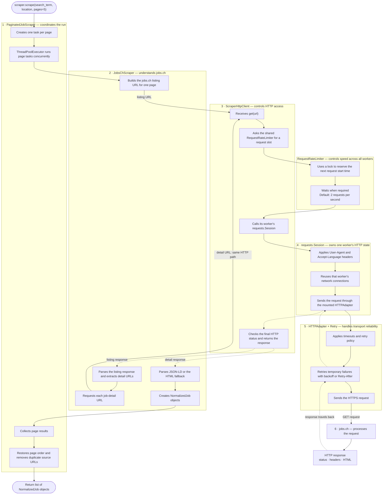

# Job Scraper Workflow

This document shows the normal path from `scraper.scrape()` to jobs.ch and back.
The diagram emphasizes which component is responsible for each part of the work.



## Responsibility boundaries

| Component | Responsible for | Not responsible for |
|---|---|---|
| `BaseJobScraper` | Defining the common `scrape()` contract | Threads, HTTP, or jobs.ch parsing |
| `PaginatedJobScraper` | Creating page tasks, running the thread pool, collecting, ordering, and deduplicating results | Website-specific URLs or HTML parsing |
| `JobsChScraper` | Building jobs.ch URLs, discovering detail links, parsing responses, and creating `NormalizedJob` objects | Generic thread coordination or retry implementation |
| `RequestRateLimiter` | Enforcing one request rate across every worker belonging to the scraper | Sending requests or interpreting responses |
| `ScraperHttpClient` | Connecting the rate limiter to the session and checking final HTTP errors | Understanding jobs.ch HTML |
| `requests.Session` | Keeping one worker's headers, cookies, and reusable connections | Coordinating other worker sessions |
| `HTTPAdapter` and `Retry` | Connection pooling, retries, backoff, and `Retry-After` handling | Page scheduling or job normalization |
| `jobs.ch` | Receiving the request and returning an HTTP response | Internal scraper behavior |

## Important ownership rule

```text
One JobsChScraper run
├── one shared RequestRateLimiter
├── one PaginatedJobScraper coordinator
└── multiple page workers
    ├── worker 1 → HTTP client 1 → Session 1 → HTTPAdapter
    ├── worker 2 → HTTP client 2 → Session 2 → HTTPAdapter
    └── worker N → HTTP client N → Session N → HTTPAdapter
```

Sessions are independent because each belongs to one worker. The limiter is shared
because it must control the combined request rate of all workers.

## Normal workflow in plain language

1. `PaginatedJobScraper.scrape()` creates five page tasks.
2. The thread pool starts those tasks concurrently.
3. Each task calls the jobs.ch-specific `_scrape_page()` method.
4. `JobsChScraper` builds a listing URL and asks its `ScraperHttpClient` to fetch it.
5. The client waits for the shared rate limiter before starting the request.
6. The worker's session applies headers and passes the request to its HTTP adapter.
7. The adapter sends the request and manages temporary retries.
8. jobs.ch returns an HTTP response through the same transport components.
9. `JobsChScraper` extracts job-detail URLs from the listing response.
10. Each detail URL follows the same client, limiter, session, and adapter path.
11. `JobsChScraper` parses each detail response into a `NormalizedJob`.
12. `PaginatedJobScraper` collects all page results, restores page order, removes
    duplicate source URLs, and returns the final job list.
